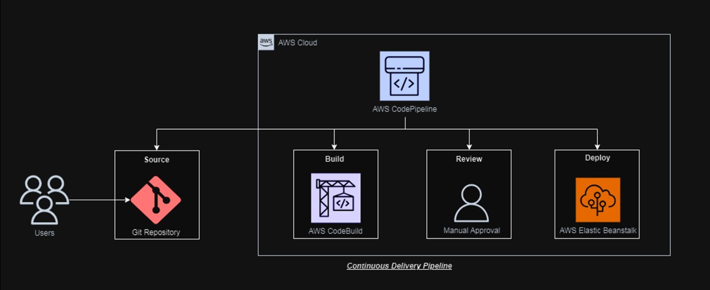
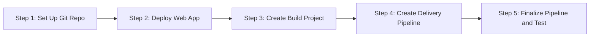

# Create-Continuous-Delivery-Pipeline
Set up a Git repo, deploy a sample web app, and create a continuous delivery pipeline

## Overview

The following diagram provides a visual representation of the services used in this tutorial and how they are connected. This application uses GitHub, AWS Elastic Beanstalk, AWS CodeBuild, and AWS CodePipeline.

Will create a continuous delivery pipeline for a simple web application. First use a version control system to store source code and Then, to create a continuous delivery pipeline that will automatically deploy web application whenever source code is updated.

**Step 1: Set Up Git Repo**

Set up a Git repo for your code so it can be easily accessed over the Internet

**Step 2: Deploy Web App**

Create and deploy a web application using AWS Elastic Beanstalk

**Step 3: Create Build Project**

Configure and execute the application build process using AWS CodeBuild

**Step 4: Create Delivery Pipeline**

Use AWS CodePipeline to set up a continuous delivery pipeline with source, build, and deploy stages

**Step 5: Finalize Pipeline and Test**

Add a review stage to your countinuous delivery pipeline using AWS CodePipeline

Prerequisites

| Requirements                | Description                                              |
| ----------------------- | -------------------------------------------------------- |
| Git-hub                 | Set up a GitHub repository for the application code      |
|AWS Elastic Beanstalk    | Create an AWS Elastic Beanstalk environment to deploy the application |
| AWS CodeBuild           | Configure AWS CodeBuild to build the source code from GitHub |
| AWS CodePipeline        | Use AWS CodePipeline to set up the continuous delivery pipeline with source, build, and deploy stages    |

